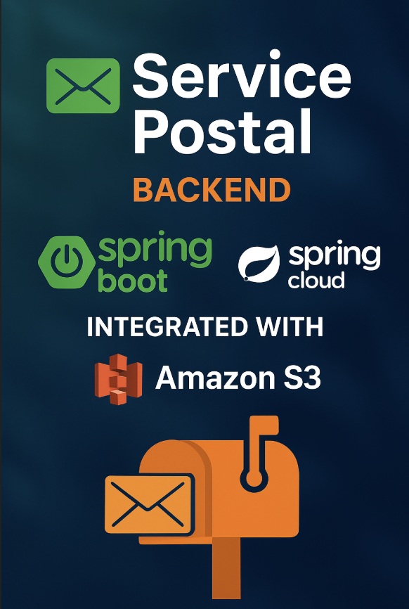

# 📬 Service Postal – Backend Spring Boot con Spring Cloud y AWS S3

Este proyecto es un **servicio backend** desarrollado con **Spring Boot**, utilizando **Spring Cloud AWS** para la gestión de almacenamiento en **Amazon S3** y un CRUD tradicional para la administración de entidades del sistema postal.

---

## 📁 Estructura del Proyecto

```
src/main/java/com/backend/service/postales
│
├── config/          → Configuración
├── controller/      → Controladores REST
├── dto/             → Data Transfer Objects
├── entity/          → Entidades JPA
├── exception/       → Excepciones personalizadas
├── repository/      → Repositorios JPA
└── service/         → Servicios
    └── imp/         → Implementaciones de servicios
```

```
src/main/resources/
├── application.properties / application.yml
├── static/
└── templates/
```

---

# 🚀 Características Principales

### 🔹 CRUD Completo

Operaciones básicas:

* Crear
* Leer
* Actualizar
* Eliminar
* Storage imagenes en S3

### 🔹 Upload de Imágenes a AWS S3

Integración con **Spring Cloud AWS**:

* Carga de imágenes al bucket configurado
* Obtención de URL pública
* Manejo de metadata y validaciones

### 🔹 Arquitectura Limpia

Capas bien organizadas:

* Controller
* Service
* Repository
* DTO Mapper
* Exception Handler

---

## 🛠️ Tecnologías Utilizadas

* **Java 17+**
* **Spring Boot**
* **Spring Data JPA**
* **Spring Web**
* **Spring Cloud AWS**
* **Amazon S3**
* **Lombok**
* **Maven**

---

## ⚙️ Configuración AWS S3

```
aws.s3.bucket-name=${AWS_S3_BUCKET_NAME}
aws.s3.region=${AWS_S3_ REGION}

```

---

# ▶️ Ejecución del Proyecto

### 1. Clonar repositorio

```
git clone https://github.com/iamcasse/Backend-SpringBoot-Christmas-Postal.git
```

### 2. Instalar dependencias

```
mvn clean install
```

### 3. Ejecutar aplicación

```
mvn spring-boot:run
```

La app se abre en:
`http://localhost:8080`

---

# 📡 Endpoints (Ejemplo)

| Método | Endpoint                      | Descripción       |
| ------ |-------------------------------|-------------------|
| POST   | `api/v1/postales`             | Crear postal      |
| GET    | `api/v1/postales`             | Listar postales   |
| GET    | `api/v1/postales/{id}`        | Obtener postal    |
| PUT    | `api/v1/postales/{id}`        | Actualizar postal |
| DELETE | `api/v1/postales/{id}`        | Eliminar postal   |
| POST   | `api/v1/postales/code/{code}` | Obtener postal    |

---

# 🧱 Árbol del Proyecto Resumido

``` css
SERVICE-POSTAL
├── .idea/
├── .mvn/
├── src/
│   ├── main/
│   │   ├── java/com/backend/service/postales/
│   │   │   ├── config/
│   │   │   ├── controller/
│   │   │   ├── dto/
│   │   │   ├── entity/
│   │   │   ├── exception/
│   │   │   ├── repository/
│   │   │   └── service/
│   │   │       └── imp/ 
│   │   └── resources/
│   └── test/
├── target/
└── pom.xml
```

---

# 🧪 Pruebas

Ejecutar pruebas:

```
mvn test
```

---

# 📄 Licencia

Este proyecto puede utilizar MIT u otra licencia que prefieras.

---

# 🤝 Contribuciones

Las contribuciones son bienvenidas.

## 📬 Contacto

Para dudas, sugerencias o contribuciones, puedes seguirnos a:

🔗 [GitHub](https://github.com/iamcasse)

💡 **Desarrollado por Casse como parte de una arquitectura de microservicios con Spring Cloud.**

_**💚 ¡Gracias por revisar este proyecto!... Powered by Casse 🌟📚🚀...!!**_

## Derechos Reservados

```markdown
© 2025 Casse. Todos los derechos reservados.
```
